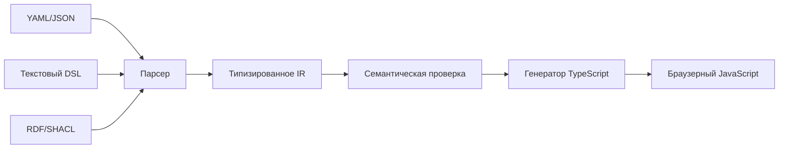

# Варианты DSL для RDF Grapher

Цель DSL — описывать данные, фильтры, нотацию и сценарий визуализации декларативно, а затем транслировать описание в JavaScript/TypeScript.

## Сравнение подходов

| Подход | Преимущества | Недостатки | Когда выбирать |
|---|---|---|---|
| JSON/YAML-конфигурация | Простые парсеры, JSON Schema, хорошая интеграция с TypeScript | Слабая выразительность, многословные условия | Для первой версии и пользовательских настроек |
| Внутренний TypeScript DSL | Типы, автодополнение, функции высшего порядка, нет отдельного компилятора | Пользователь должен знать TypeScript; выполнение кода требует доверия | Для разработчиков и плагинов |
| Текстовый предметный DSL | Краткий синтаксис, понятные сообщения об ошибках, можно ограничить возможности | Нужны грамматика, парсер, диагностика и генератор | Для конечной цели — самостоятельного языка моделей |
| RDF/SHACL как DSL | Нативная совместимость с RDF, переиспользование словарей и SHACL-валидации | Визуальные правила становятся громоздкими; порог входа выше | Для обмена семантическими моделями |

## Рекомендация

Начать с декларативного YAML/JSON-ядра и JSON Schema, а затем добавить компактный текстовый синтаксис, который компилируется в то же промежуточное представление (IR). TypeScript-типы для IR становятся единым контрактом между парсером, валидатором и генератором.



## Предлагаемое IR

```ts
interface GraphProgram {
  source: { format: 'turtle' | 'n-triples' | 'n-quads' | 'trig'; data: string };
  view: { mode: 'notation' | 'base' | 'aggregation' | 'vad'; layout: string };
  filters: Array<{ predicate: string; visible: boolean }>;
  styles: Array<{ selector: { type?: string; predicate?: string }; dot: string }>;
}
```

Пример будущего текстового DSL:

```text
graph orders from "orders.ttl" as turtle
view vad layout dot
hide rdf:type, vad:hasParent
node vad:Process shape cds fill "#A5D6A7"
edge vad:hasNext color "#2E7D32" arrow vee
```

## Этапы реализации

1. Зафиксировать TypeScript IR и JSON Schema.
2. Перенести текущие объекты фильтров и стилей в IR без потери поведения.
3. Добавить YAML/JSON-загрузчик и проверку схемы.
4. Спроектировать небольшую EBNF-грамматику текстового DSL.
5. Генерировать TypeScript, а затем существующим `tsc` — браузерный JavaScript.
6. Добавить тесты «DSL → IR → DOT» и точные сообщения с позицией ошибки.

Безопасность важна: пользовательский DSL следует разбирать как данные, а не выполнять через `eval` или `Function`.
