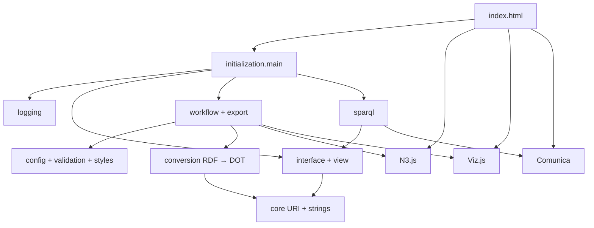

# Архитектура TypeScript

Версия `ver1` переписана на TypeScript и разделена на функциональные группы. Исходный монолит сохранён в `original/index.html` только как эталон. Рабочая страница подключает скомпилированный `dist/app.js`.

## Структура

- `src/00-types.ts` — общие RDF-типы, объявления браузерных библиотек и безопасный поиск DOM-элементов.
- `src/01-logging.ts` — журналирование запуска, успеха, ошибки и времени функций.
- `src/02-config-validation-styles.ts` — режимы, фильтры, стили и VAD-валидация.
- `src/03-core-examples.ts` — чистые строковые/URI-функции и встроенные RDF-примеры.
- `src/04-interface.ts` — масштабирование, свойства узлов, фильтры и обработчики графа.
- `src/05-conversion.ts` — преобразование RDF в DOT для обычного, агрегированного и VAD-режимов.
- `src/06-view.ts` — состояния загрузки/ошибки, префиксы, легенда и переключатели UI.
- `src/07-workflow-export.ts` — основной сценарий визуализации и экспорт SVG/PNG/URL.
- `src/08-sparql.ts` — инициализация Comunica, запросы и навигация по результатам.
- `src/09-initialization.ts` — публикация групп API, URL-параметры и единственная функция `main()`.

## Запуск

`main()` вызывается после `DOMContentLoaded`. Она собирает публичный объект `window.RdfGrapher`, группирует функции и добавляет журналирующую обёртку. Для обратной совместимости обработчики также публикуются в `window`, поэтому существующие атрибуты `onclick` продолжают работать.

Журнал в нижней части интерфейса показывает время, группу, имя каждой вызываемой функции, результат и длительность публичных операций. Сборщик добавляет входное журналирование к именованным функциям с сохранением исходной структуры TypeScript. Чистые функции доступны через `RdfGrapher.core`, а VAD-валидация — через `RdfGrapher.validation`, что позволяет проверять их без браузера.

Разработка использует Node.js только для TypeScript-компилятора и тестов. Готовые `index.html` и `dist/app.js` работают непосредственно в браузере: на GitHub Pages или после скачивания каталога `ver1`.
